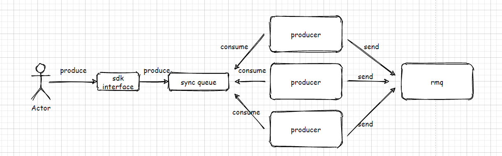
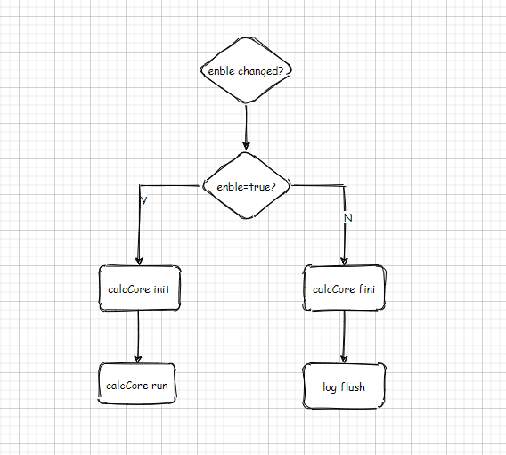
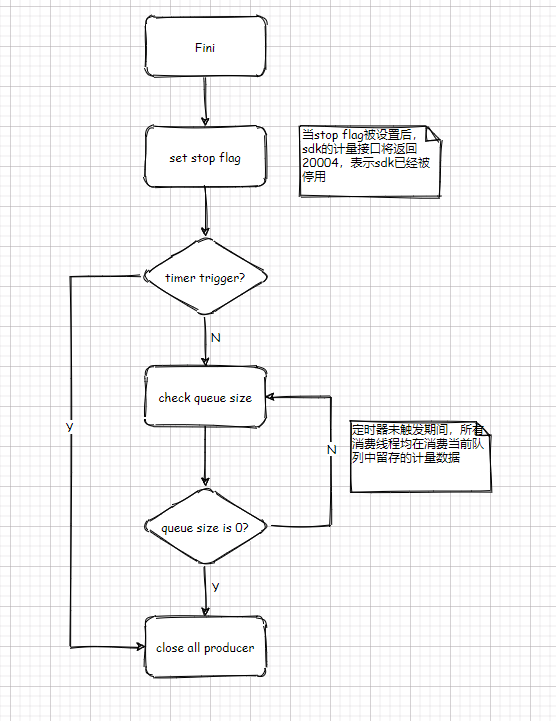

### 运营管控系统之计量SDK

---

该SDK提供用量统计功能，用量记入运营管控系统，配合鉴权服务可实现用量鉴权控制。


#### feature

- 异步计量接口
- 支持配置中心
- 多rmq地址配置
- 计量热开关
- 异常连接自修复（退避算法）


#### 接口说明

```go
/*
    初始化接口
    in:
	@url 配置中心地址
	@pro 配置中心项目名称
	@gro 配置中心分组名称
	@service 配置中心服务名称，集成该sdk的服务
	@version 配置中心服务版本号，集成该sdk的版本号
	@isNative 是否使用本地配置，true为使用本地配置
	@nativeLogPath 本地配置文件路径
	out:
		error 当初始化异常时返回error信息，正常时error为nil
	
*/
func Init(url, pro, gro, service, version string, isNative bool, nativeLogPath string) error

/*
	销毁接口
*/
func Fini()

/*
	appid计量接口
	in:
	@appid 应用ID,如测试APPID 4CC5779A
	@channel 渠道名称,如合成渠道tts，听写渠道iat
	@funcs 功能名称，如合成业务发音人vcn.xiaoyan
	@c 用量值
	out:
	@errorcode 返回错误码，正常时返回0
	@err 错误信息，正常时为nil
*/
func Calc(appid, channel, funcs string, c int64) (errorcode int, err error)

/*
	subID计量接口
	in:
	@appid 应用ID,如测试APPID 4CC5779A
	@subId 应用子ID,如uid（用户ID），did（设备ID）等
	@channel 渠道名称,如合成渠道tts，听写渠道iat
	@funcs 功能名称，如合成业务发音人vcn.xiaoyan
	@c 用量值
	out:
	@errorcode 返回错误码，正常时返回0
	@err 错误信息，正常时为nil
*/
func CalcWithSubId(appid, subId, channel, funcs string, c int64) (errorcode int, err error)

/*
	appid多租户计量接口
	in:
	@appid 应用ID,如测试APPID 4CC5779A
	@cloudid 云标识，如公有云id为0
	@composeid 组合能力id
	@service 服务ID
	@funcs 功能名称，如合成业务发音人vcn.xiaoyan
	@c 用量值
	out:
	@errorcode 返回错误码，正常时返回0
	@err 错误信息，正常时为nil
*/
func CalcMultiTenancy(appid, cloudid , composeid , serviceid , funcs string, c int64) (errorcode int, err error)

/*
	subID计量接口
	in:
	@appid 应用ID,如测试APPID 4CC5779A
	@subId 应用子ID,如uid（用户ID），did（设备ID）等
	@cloudid 云标识，如公有云id为0
	@composeid 组合能力id
	@service 服务ID
	@funcs 功能名称，如合成业务发音人vcn.xiaoyan
	@c 用量值
	out:
	@errorcode 返回错误码，正常时返回0
	@err 错误信息，正常时为nil
*/
func CalcWithSubIdMultiTenancy(appid, subId, cloudid , composeid , serviceid , funcs string, c int64) (errorcode int, err error)
```


#### 错误码

```go
	CalcSuccess             = &CalcError{Code: 0, Desc: "success"}
	CalcInvalidParams       = &CalcError{Code: 20000, Desc: "invalid user parameters"}
	CalcQueueFull           = &CalcError{Code: 20001, Desc: "message queue is fulled"}
	CalcHasNotInited        = &CalcError{Code: 20002, Desc: "sdk had not been initialized"}
	CalcServerConnectFailed = &CalcError{Code: 20003, Desc: "client can not connect to the server"}
	CalcStoped              = &CalcError{Code: 20004, Desc: "sdk has finished"}
	CalcFinderInitFailed    = &CalcError{Code: 20005, Desc: "finder init failed"}
	CalcNoSuchKeyInConfig   = &CalcError{Code: 20006, Desc: "no such key in config map"}
	CalcTypeAssertError     = &CalcError{Code: 20007, Desc: "varible type assert error"}
	CalcHostsOrTopicError   = &CalcError{Code: 20008, Desc: "hosts or topic invalid"}
```


#### demo

```go
package main

import (
	"fmt"
	"git.iflytek.com/MeteringAuth/calc-sdk-golang/calc"
)

func main() {
	// 初始化参数
	// @url 配置中心地址
	// @pro 配置中心项目名
	// @gro 配置中心项目分组名
	// @isNative 是否使用本地配置
	// @nativeLogPath 本地配置路径（仅当isNative为true时生效）
	if err := calc.Init("http://10.1.87.69:6868", "guiderAllService", "gas", "calc-client", "2.1.0", false, "./calc.toml"); err != nil {
		fmt.Println("calc init error : ", err)
		return
	}

	// 调用计量函数
	// @appid 应用名称
	// @channel 业务渠道
	// @funcs 功能名称
	// @c 用量
	// 该函数只计量APPID
	code, err := calc.Calc("testCalcSDK", "calcsdk", "nothing", 1)
	if err != nil {
		fmt.Printf("errocde : %d , errorInfo = %s", code, err)
		return
	}
	// 调用计量函数
	// @appid 应用名称
	// @did 设备id
	// @channel 业务渠道
	// @funcs 功能名称
	// @c 用量
	// 该函数只计量SubId
	code, err = calc.CalcWithSubId("testCalcSDK", "did", "calcsdk", "nothing", 1)
	if err != nil {
		fmt.Printf("errocde : %d , errorInfo = %s", code, err)
		return
	}

	// sdk 析构
	calc.Fini()
	fmt.Println("program terminated")

}

```


#### 配置文件

```toml
[calc]
# 异步队列大小，流量大队列小可能导致消息丢失
queue_size = 10000
# 异步队列消费者数量
consume_number = 4
# 远端rmq服务地址，可配置多个，如：["10.1.87.19:10800","10.1.87.20:10800"]
hosts = ["10.1.87.19:10800"]
# rmq topic
topic = "mts_isol"
# 消息队列服务连接超时时间(ms)
timeout = 500
# sdk使能开关
enable = true

[log]
level = "info"
path = "./calc.log"
# 日志格式，可选：json,normal
format = "json" 
# 是否打屏
console_print = false

```


#### 基本原理与架构

**交互图**




**热开关逻辑流程**



**sdk销毁流程**
Fini后的用户交互


队列内留存数据清理



